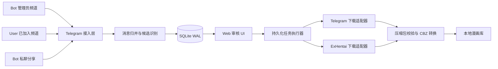
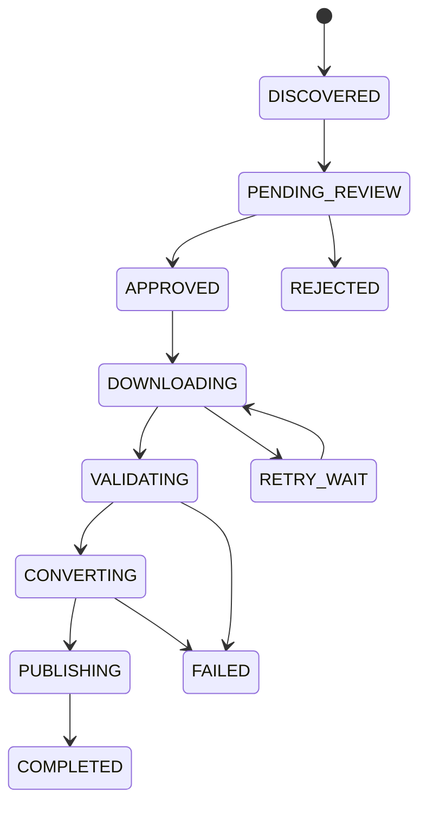

# EhBot 开发方案

## 1. 文档信息

| 项目 | 内容 |
|------|------|
| 项目名称 | EhBot |
| 文档版本 | 1.0 |
| 编制日期 | 2026-08-19 |
| 项目性质 | 从零建设 |
| 首选部署 | Docker 单容器 |
| 最低目标环境 | 1 核 CPU、512 MB 内存 |
| 推荐环境 | 1～2 核 CPU、1 GB 内存 |

## 2. 项目概述

EhBot 用于订阅指定 Telegram 频道并接收用户私聊分享，识别频道中的漫画预览、ExHentai 链接和压缩包，将满足规则的内容加入人工审核队列。操作员通过 Web UI 审核并修订元数据，审核通过后由系统下载压缩包、校验内容、生成包含 `ComicInfo.xml` 的 CBZ 文件，并归档到指定本地目录。

系统以 Telegram 下载为主。当消息只提供 ExHentai 画廊链接时，可在账号授权和站点规则允许的范围内自动获取元数据及归档文件。原始压缩包默认在 CBZ 成功发布后删除，也可以全局、按来源或按单次任务选择保留。

## 3. 前提与边界

### 3.1 已确认前提

- Ex 站点为 ExHentai，部署者拥有可正常访问的账号和 Cookie。
- 部分 Telegram 频道允许将 Bot 设置为管理员，部分频道只能由已加入频道的用户账号监听。
- 系统需要支持频道推送和 Bot 私聊分享两种入口。
- Telegram 是主要文件来源，ExHentai 是元数据来源和补充下载来源。
- 必须提供 Web 审核 UI。
- 必须支持 Docker，并直接暴露可配置 HTTP 端口。
- HTTPS、域名和反向代理由部署者负责。

### 3.2 不在第一版范围内

- 不提供绕过 Telegram 内容保护、频道访问权限或 ExHentai 账号权限的能力。
- 不提供公网 HTTPS 证书申请和自动配置。
- 不提供多租户、公开注册和复杂角色权限系统。
- 不默认使用 Torrent 下载。（阶段 14 推翻：`DOWNLOAD_SOURCE_CHAIN_PROPOSAL.md` 把 EH 种子定为超限本子的首选原档来源，理由是种子免费而 Archive Download 消耗 GP）
- 不默认在 Ex 归档失败后无限制逐页抓图。（阶段 14 部分推翻：允许抓取频道自建的 `telegra.ph` 预览页作为最后兜底，有张数、字节与超时上限；EH 画廊本体仍不逐页抓）
- 不建设分布式微服务、Redis、Celery 或消息队列集群。
- 不对漫画图片进行 OCR、翻译、去水印或图像增强。

## 4. 建设目标

### 4.1 功能目标

1. 同时支持 Telegram Bot 会话和用户账号会话。
2. 识别“仅预览”“预览加压缩包”“仅压缩包”三类推送。
3. 将相关消息可靠归并为同一个候选漫画。
4. 按来源、标签、文件类型和大小等规则筛选候选内容。
5. 提供完整的人工审核、修订、通过、驳回和重试界面。
6. 审核通过前不下载完整压缩包。
7. 优先从 Telegram 下载，必要时从 ExHentai 获取归档。
8. 将 ZIP、RAR、7Z 或图片目录转换成标准 CBZ。
9. 在 CBZ 内生成 `ComicInfo.xml`。
10. 支持原始压缩包保留策略和任务失败恢复。

### 4.2 非功能目标

- 低配模式下可在 1C512M 环境持续监听、审核和处理以 ZIP 为主的任务。
- 下载和转换过程采用流式 I/O，内存占用不随压缩包大小线性增长。
- 服务重启后，候选、审核结果和未完成任务不能丢失。
- 相同消息或画廊重复推送时，不产生重复下载和重复归档。
- 外部接口变化只影响对应适配器，不扩散到审核和归档逻辑。
- 所有敏感凭据不得写入源码、数据库普通字段或日志。

## 5. 可行性结论

整体方案可行，主要不确定性集中在 ExHentai 归档下载页面的稳定性，而不是 Telegram 监听、审核 UI 或 CBZ 转换。

| 模块 | 可行性 | 说明 |
|------|--------|------|
| Bot 管理员频道监听 | 高 | 使用 Telethon Bot 会话接收频道更新 |
| 非 Bot 频道监听 | 高 | 使用已加入频道的用户账号会话，只监听白名单频道 |
| 私聊分享 | 高 | Bot 会话直接接收消息、转发和附件 |
| 消息归并 | 中高 | 需要结合消息组、回复关系、Ex 链接和时间窗口 |
| Telegram 大文件下载 | 高 | 使用 MTProto，避免 Bot API `getFile` 20 MB 限制 |
| Ex 元数据补全 | 高 | 优先使用结构化 `gdata` API |
| Ex 自动归档下载 | 中 | 依赖 Cookie、额度和 HTML 页面流程，应独立封装并真实联调 |
| ZIP 转 CBZ | 高 | Python 标准库支持流式处理 |
| RAR/7Z 转 CBZ | 中高 | 使用 `7zz`，资源消耗取决于压缩字典 |
| 1C512M 运行 | 中高 | ZIP 主流程可满足；RAR/7Z 推荐 1 GB |

## 6. 总体架构



系统采用异步单体架构。FastAPI、Telegram 客户端、任务调度器和 Web UI 运行在同一个 Python 进程中；`7zz` 仅在需要处理 RAR/7Z 时作为受控子进程启动。

## 7. 技术栈

| 层次 | 技术 | 用途 |
|------|------|------|
| 语言 | Python 3.12 | 主运行时 |
| Telegram | Telethon、可选 `cryptg` | Bot/User 会话、消息监听和媒体下载 |
| Web API | FastAPI | 页面路由、审核接口、健康检查 |
| Web Server | Uvicorn，单 worker | 对外提供 HTTP 服务 |
| Web UI | Jinja2、HTMX、原生 JavaScript | 服务端渲染审核界面 |
| 数据库 | SQLite WAL | 候选、审核、任务和配置持久化 |
| HTTP | `httpx.AsyncClient` | Ex API、页面和归档流式下载 |
| HTML 解析 | `selectolax` | 低开销解析 ExHentai 页面 |
| ZIP/CBZ | Python `zipfile` | 流式生成 CBZ |
| RAR/7Z | `7zz` | 非 ZIP 压缩包检查和解压 |
| 测试 | pytest、pytest-asyncio | 单元和集成测试 |
| 依赖管理 | `uv`、`pyproject.toml`、`uv.lock` | 可重复构建 |
| 部署 | Docker、Docker Compose | 生产部署 |

不将 ComicPacker 作为运行时依赖。项目参考其元数据字段和使用方式，但重新实现流式转换器，避免 `comic.pack()` 将整个 CBZ 放入内存。若直接采用其 MIT 代码片段，必须在第三方声明中保留许可证和来源。

## 8. 功能模块

### 8.1 Telegram 接入模块

模块同时管理两类 Telethon 会话：

- Bot Client：监听允许设置管理员的频道，接收私聊消息和附件，发送任务反馈。
- User Client：监听无法添加 Bot、但授权用户账号已加入的频道。

主要职责：

- 维护连接、重连和 FloodWait 等待。
- 仅接受配置白名单中的频道和私聊用户。
- 保存原始消息标识、文本、实体、附件描述和回复关系。
- 保存 Telegram `file_id`、`file_unique_id`、文件名、大小和 MIME 类型。
- 处理新消息和消息编辑；消息删除只记录状态，不自动删除已归档 CBZ。

### 8.2 消息归并模块

归并优先级如下：

1. 相同 `media_group_id`。
2. 明确的回复关系。
3. 相同 ExHentai `gid + token`。
4. 相同频道、相邻消息、相同发送者和时间窗口。
5. 压缩包文件名与预览标题的相似关系。

时间窗口默认 180 秒，可按来源调整。系统无法确定归属时，应生成独立候选并允许人工合并，不能静默关联。

### 8.3 候选筛选模块

第一版支持以下规则：

- Telegram 来源白名单。
- 私聊发送者白名单。
- 是否包含 Ex 链接、压缩包或预览元数据。
- 允许或禁止的压缩格式。
- 最大附件尺寸。
- 标签包含、排除规则。
- 语言、分类和最低评分规则。

规则结果分为：

```text
ACCEPT      进入待审核队列
IGNORE      忽略并记录原因
NEEDS_INFO 信息不足，进入待补充队列
```

### 8.4 元数据模块

元数据按字段保存来源和置信度，不直接覆盖为一份不可追踪的结果。

优先级：

```text
人工修改 > Telegram 明确字段 > E-Hentai API > ExHentai HTML > 标题推断
```

主要字段：

| 业务字段 | ComicInfo.xml |
|----------|---------------|
| 标题 | `Title` |
| 系列 | `Series` |
| 卷号 | `Number` |
| 作者 | `Writer` |
| 社团/出版者 | `Publisher` |
| 标签 | `Tags` |
| 分类 | `Genre` |
| 语言 | `LanguageISO` |
| 页数 | `PageCount` |
| 简介 | `Summary` |
| Web 来源 | `Web` |
| 黑白/彩色 | `BlackAndWhite` |
| 漫画方向 | `Manga` |

频道解析器按来源配置模板或正则规则。解析失败时保留原文，不阻止人工审核。

### 8.5 ExHentai 模块

模块分为两个适配器：

#### 元数据适配器

- 从画廊 URL 提取 `gid + token`。
- 使用 E-Hentai `gdata` API 获取结构化元数据。
- 每批最多请求 25 个画廊。
- 请求突发后主动等待，处理 429 和临时错误。
- API 不足时，使用带 Cookie 的 ExHentai 页面补充字段。

#### 归档下载适配器

- 使用 `ipb_member_id`、`ipb_pass_hash` 和 `igneous` 建立授权会话。
- 下载前验证 Cookie 和画廊访问状态。
- 解析官方归档选择和确认页面。
- 显示原图/重采样选择、预估大小和额度状态。
- 审核通过后流式下载归档到工作目录。
- 页面结构变化、Cookie 失效或额度不足时返回明确错误，不进行无限重试。

逐页下载作为后续可选 Provider。第一版默认仅在明确开启后使用，且不会自动替代失败的官方归档下载。

### 8.6 Web 审核模块

Web UI 至少包含：

- 登录页。
- 待审核列表。
- 待补充列表。
- 审核详情页。
- 下载和转换任务页。
- 已完成归档页。
- 失败任务页。
- 来源频道和规则配置页。
- Telegram、ExHentai 连接状态页。
- 磁盘空间和工作队列状态页。

审核详情支持：

- 查看预览图、原消息、附件和 Ex 链接。
- 修改标题、系列、卷号、作者、社团、语言和标签。
- 选择 Telegram 或 ExHentai 下载来源。
- 选择 Ex 归档规格。
- 设置本次是否保留原始压缩包。
- 合并或拆分候选消息。
- 通过、驳回、重新解析和重新获取元数据。

### 8.7 持久化任务执行器

任务先写入 SQLite，再由单进程后台协程领取。不能仅使用内存队列。



任务领取使用租约字段，服务重启后将租约过期的执行中任务恢复为可重试状态。认证失败、额度不足、压缩包损坏和安全校验失败属于人工处理错误，不进行无限重试。

### 8.8 CBZ 转换模块

ZIP 输入采用成员级流式转换：

```text
列出 ZIP 成员
 -> 校验路径、大小、数量和文件签名
 -> 自然排序图片页
 -> 逐项复制到临时 CBZ
 -> 写入 ComicInfo.xml
 -> 重新打开校验
 -> 原子移动到书库
```

图片通常已经压缩，CBZ 默认使用 `ZIP_STORED`，避免在单核环境重复压缩 JPEG、PNG 和 WebP。

RAR/7Z 输入流程：

```text
7zz 列表检查
 -> 受控解压到磁盘工作目录
 -> 校验图片集合
 -> 流式生成 CBZ
 -> 清理工作目录
```

安全校验包括：

- 拒绝绝对路径、`..` 和目录穿越。
- 限制压缩包大小、解压总大小、文件数和目录深度。
- 检查异常压缩率和嵌套压缩包。
- 对图片扩展名和文件魔数交叉校验。
- 对重名页面生成稳定的新名称。
- 输出先写入 `.part` 文件，成功后原子重命名。
- 只有 CBZ 发布成功后才能删除原始压缩包。

### 8.9 本地存储模块

默认目录：

```text
/app/data      SQLite、Telegram session、应用状态
/library       最终 CBZ 书库
/work          下载、解压和转换工作目录
```

建议归档规则：

```text
/library/{分类}/{作者或社团}/{规范化标题}/{规范化标题}.cbz
```

实际模板允许通过配置修改，但模板变量只允许使用已定义的元数据字段，所有路径段必须清洗。

## 9. 数据模型

### 9.1 核心表

| 表名 | 用途 |
|------|------|
| `telegram_accounts` | Bot/User 会话配置和状态，不保存秘密明文 |
| `telegram_sources` | 频道、私聊来源和筛选规则 |
| `source_messages` | Telegram 原始消息及附件描述 |
| `candidates` | 待审核漫画候选主记录 |
| `candidate_messages` | 候选与消息的多对多归并关系 |
| `metadata_values` | 带来源和置信度的元数据字段 |
| `review_actions` | 审核动作、操作人和时间 |
| `download_jobs` | 下载、校验、转换和发布任务 |
| `artifacts` | 原包、工作文件和最终 CBZ 信息 |
| `schema_migrations` | 数据库迁移版本 |

### 9.2 幂等键

```text
Telegram 消息：account_id + chat_id + message_id
Telegram 文件：file_unique_id
ExHentai 画廊：gid + gallery_token
最终内容：下载过程中计算 SHA-256
```

同一 `gid + token` 可以关联多个频道消息，但默认只产生一个有效候选和一个最终归档任务。

### 9.3 SQLite 配置

```sql
PRAGMA journal_mode = WAL;
PRAGMA synchronous = NORMAL;
PRAGMA busy_timeout = 5000;
PRAGMA foreign_keys = ON;
```

数据库操作使用短事务。下载进度按时间或字节阈值更新，不能每个数据块都写数据库。

## 10. 内部接口边界

```python
class SourceAdapter:
    async def start(self) -> None: ...
    async def stop(self) -> None: ...

class MetadataProvider:
    async def fetch(self, reference) -> MetadataResult: ...

class DownloadProvider:
    async def download(self, request, destination) -> DownloadResult: ...

class ArchiveConverter:
    async def convert(self, source, destination, metadata) -> ConvertResult: ...

class StorageBackend:
    async def publish(self, artifact, metadata) -> PublishedArtifact: ...
```

接口只覆盖真实的替换点，不为单一实现增加多余抽象。第一版 `StorageBackend` 只有本地磁盘实现。

## 11. 项目目录

```text
EhBot/
├─ pyproject.toml
├─ uv.lock
├─ Dockerfile
├─ compose.yaml
├─ .env.example
├─ app/
│  ├─ main.py
│  ├─ config.py
│  ├─ domain/
│  ├─ telegram/
│  ├─ exhentai/
│  ├─ archive/
│  ├─ jobs/
│  ├─ storage/
│  ├─ db/
│  │  └─ migrations/
│  └─ web/
│     ├─ templates/
│     └─ static/
├─ tests/
│  ├─ unit/
│  ├─ integration/
│  └─ fixtures/
├─ scripts/
└─ docs/
```

## 12. Docker 部署方案

### 12.1 镜像

- 基础镜像使用 `python:3.12-slim-bookworm`。
- 采用多阶段构建。
- 最终镜像安装 `7zz`、CA 证书和时区数据。
- 最终容器不包含 Node.js、编译缓存、PyInstaller、Chromium、Nginx 或 Caddy。
- 应用使用非 root 用户运行。

### 12.2 端口

容器内固定监听：

```text
0.0.0.0:8080
```

宿主端口通过 Compose 配置：

```yaml
ports:
  - "${EHBOT_PORT:-8080}:8080"
```

容器提供：

```text
/             Web UI
/api/*        页面使用的 API
/healthz      进程存活检查
/readyz       数据库和目录就绪检查
/static/*     静态资源
```

EhBot 不内置 HTTPS。部署者可直接访问 `http://服务器IP:8080`，或自行将 HTTPS 反向代理到该端口。

### 12.3 卷

```yaml
volumes:
  - ./data:/app/data
  - ${LIBRARY_PATH:-./library}:/library
  - ${WORK_PATH:-./work}:/work
```

`/work` 必须使用磁盘目录，不能使用内存型 `tmpfs`。

### 12.4 反向代理兼容

提供以下配置：

```text
TRUST_PROXY_HEADERS=false
TRUSTED_PROXY_IPS=
APP_ROOT_PATH=
SESSION_COOKIE_SECURE=false
```

只有可信代理来源才能使用 `X-Forwarded-For` 和 `X-Forwarded-Proto`。HTTPS 反向代理场景由部署者将 `SESSION_COOKIE_SECURE` 设置为 `true`。

## 13. 配置与秘密管理

普通配置使用环境变量或只读配置文件。秘密同时支持直接环境变量和 `*_FILE` 文件模式，便于接入 Docker secrets。

关键配置包括：

```text
APP_SECRET_KEY_FILE
TELEGRAM_API_ID
TELEGRAM_API_HASH_FILE
TELEGRAM_BOT_TOKEN_FILE
EXHENTAI_IPB_MEMBER_ID_FILE
EXHENTAI_IPB_PASS_HASH_FILE
EXHENTAI_IGNEOUS_FILE
DOWNLOAD_CONCURRENCY
CONVERT_CONCURRENCY
KEEP_ORIGINAL
LIBRARY_PATH
WORK_PATH
```

要求：

- `.env` 不进入 Git。
- 管理员首次启动密码由系统自动生成，明文只写入数据目录中的私有临时文件；未手动修改前每次重启轮换。
- 管理员在 Web UI 修改密码后删除临时密码文件，此后仅在 SQLite 中保存强哈希。
- 日志必须对 Token、Cookie、Authorization 和查询参数脱敏。
- Web UI 只能显示凭据健康状态，不能回显秘密。
- Telethon session 权限限制为容器运行用户可读写。

## 14. 安全设计

### 14.1 Web 安全

- 第一版仅提供管理员账号，不提供公开注册。
- 密码只保存强哈希。
- 首次登录必须修改系统生成的临时密码。
- 使用 HttpOnly、SameSite 会话 Cookie。
- 所有修改操作实施 CSRF 校验。
- 登录失败实施速率限制和短期锁定。
- 默认不信任代理转发头。

### 14.2 下载安全

- 仅允许配置的 Telegram 来源和 E-Hentai/ExHentai 域名。
- HTTP 重定向后重新校验目标域名，防止 SSRF。
- 设置连接、读取和总任务超时。
- 限制响应大小并检查剩余磁盘空间。
- 不执行压缩包内任何程序或脚本。

### 14.3 内容安全

- 拒绝路径穿越和符号链接逃逸。
- 拒绝超限压缩包、压缩炸弹和异常嵌套包。
- 所有文件操作限定在任务工作目录和书库目录内。
- 删除原包前必须验证最终 CBZ 存在、可打开且记录已提交。

## 15. 性能与资源设计

### 15.1 资源档位

| 配置 | 低配模式 | 推荐模式 |
|------|----------|----------|
| CPU | 1 核 | 1～2 核 |
| 内存 | 512 MB | 1 GB |
| Swap | 推荐 1 GB | 推荐 1 GB |
| Uvicorn worker | 1 | 1 |
| 下载并发 | 1 | 2 |
| 转换并发 | 1 | 1 |
| Ex 逐页并发 | 1 | 2～3 |

### 15.2 低配措施

- Telegram、Web 和任务执行器共用一个 asyncio 进程。
- 下载使用固定大小缓冲区，不读取完整文件到内存。
- ZIP 转换逐成员复制，不完整解压且不构造完整 CBZ 字节数组。
- 图片写入 CBZ 默认使用 `ZIP_STORED`。
- 不实时生成高分辨率缩略图，优先使用 Telegram 或 Ex 现有缩略图。
- 不在容器中运行 Node、数据库服务或反向代理。
- 下载和转换任务在低配模式下串行执行。

### 15.3 性能边界

- ZIP 主流程是 512 MB 环境的保证路径。
- RAR/7Z 解压内存取决于压缩字典，不能承诺所有压缩包均在 512 MB 内完成。
- 处理 RAR/7Z 或超大画廊时推荐至少 1 GB 内存。
- 磁盘应预留至少“原包 + 解压内容 + CBZ”的最坏空间；ZIP 流式路径通常只需“原包 + CBZ”。

## 16. 日志、监控与运维

日志使用结构化文本输出到标准输出，由 Docker 收集。日志字段包括：

```text
timestamp
level
event
candidate_id
job_id
source_type
duration_ms
error_code
```

不得记录消息完整敏感内容、Cookie、Bot Token、API Hash 或下载授权链接。

健康检查：

- `/healthz`：进程事件循环可响应即返回成功。
- `/readyz`：检查数据库可写、数据目录可写、书库可写和迁移完成。

第一版不单独部署 Prometheus。提供队列数量、失败数量、磁盘空间和连接状态的管理页面，并保留后续增加指标端点的边界。

## 17. 测试方案

### 17.1 单元测试

- Ex URL、Telegram 链接和文件名解析。
- 频道消息元数据解析。
- 消息归并规则和冲突处理。
- 候选筛选规则。
- 元数据优先级与人工覆盖。
- 自然排序、路径清洗和文件名冲突。
- 状态机合法和非法迁移。
- 重试策略和幂等键。

### 17.2 压缩包安全测试

- 正常 ZIP、嵌套目录 ZIP、非 ASCII 文件名。
- 路径穿越、绝对路径和符号链接。
- 超大文件数、异常压缩率和伪造图片扩展名。
- 损坏 ZIP、加密 ZIP、RAR 和 7Z。
- 转换中断后 `.part` 文件清理和任务恢复。

### 17.3 集成测试

- 使用录制或构造的 Telegram Update fixture 测试三种消息形态。
- 使用模拟 HTTP 服务测试 Ex API、Cookie 失效、429、额度不足和页面变更。
- 使用临时 SQLite 测试重启恢复和重复消息。
- 使用临时目录验证原始压缩包保留/删除策略。
- 验证生成的 CBZ 可重新打开并包含正确的 `ComicInfo.xml`。

### 17.4 Docker 验收

- `docker compose up -d` 后健康检查通过。
- 映射端口可从宿主机和外部网络访问。
- 容器重建后数据库、session 和书库不丢失。
- 在 1C512M 限制下完成监听、审核和典型 ZIP 转换。
- 在 1 GB 配置下完成代表性 RAR/7Z 转换。

真实 Telegram 和 ExHentai 联调只使用测试账号和受控测试数据，凭据通过私有配置注入。

## 18. 开发阶段与交付物

### 阶段 1：基础工程和持久化

内容：

- Python 工程、配置、日志和异常体系。
- SQLite 表结构和迁移。
- FastAPI、登录、基础布局和健康检查。
- Dockerfile、Compose 和持久化卷。

验收：容器可启动、端口可访问、重建后数据保留。

### 阶段 2：Telegram 接入和候选队列

内容：

- Bot Client、User Client 和 session 初始化。
- 频道/私聊白名单。
- 原始消息保存、消息归并和候选筛选。
- 待审核列表和详情页。

验收：三种消息形态均能生成正确候选，重复更新不重复建单。

### 阶段 3：审核和 Telegram 下载

内容：

- 元数据编辑、通过、驳回和审计记录。
- SQLite 持久化任务执行器。
- Telegram 流式下载、进度和失败恢复。
- 原包保留策略。

验收：只有审核通过的候选会下载，重启后任务可恢复。

### 阶段 4：CBZ 转换和归档

内容：

- ZIP 流式转换。
- `ComicInfo.xml`。
- RAR/7Z 受控解压。
- 安全校验、原子发布和清理。

验收：典型格式可转换，恶意或损坏压缩包被安全拒绝，输出可被阅读器打开。

### 阶段 5：ExHentai 元数据和自动归档

内容：

- `gdata` 元数据适配器。
- Cookie 健康检查。
- ExHentai 归档下载适配器。
- 限流、额度不足、登录失效和页面变化错误处理。

验收：仅 Ex 链接的候选可补全元数据，并在人工批准后下载归档或返回可理解的错误。

### 阶段 6：低配优化和发布

内容：

- 1C512M/1 GB 两档测试。
- 大文件、断网、重启和磁盘不足测试。
- UI 细节、日志脱敏、部署文档和备份恢复说明。

验收：满足本方案的资源、可靠性、安全和 Docker 验收条件。

## 19. 工作量估算

以下为一名熟悉 Python 异步开发人员的初步估算，不包含 ExHentai 页面发生重大变化或 Telegram 账号风控处理时间。

| 阶段 | 估算 |
|------|------|
| 基础工程和持久化 | 2～3 人日 |
| Telegram 接入和候选归并 | 4～6 人日 |
| Web 审核和任务执行 | 4～5 人日 |
| 下载、CBZ 和压缩包安全 | 5～7 人日 |
| ExHentai 元数据和归档 | 4～7 人日 |
| 测试、低配优化和发布 | 4～6 人日 |
| 合计 | 23～34 人日 |

建议先完成阶段 1～4，形成 Telegram 主链路 MVP，再接入 Ex 自动归档。这样即使 Ex 页面联调延迟，核心系统仍可交付使用。

## 20. 主要风险与应对

| 风险 | 影响 | 应对 |
|------|------|------|
| ExHentai 页面结构变化 | 自动归档失效 | 独立适配器、HTML fixture、明确失败状态 |
| Ex Cookie 失效或额度不足 | 无法自动下载 | 健康检查、管理页提示、禁止无限重试 |
| Telegram FloodWait 或连接中断 | 消息延迟 | Telethon 自动重连、按服务端时间等待、状态持久化 |
| Bot 无法加入频道 | 无法通过 Bot 监听 | 使用白名单用户账号会话 |
| 消息归并错误 | 元数据和压缩包错配 | 多信号归并、置信度、人工合并/拆分 |
| 恶意压缩包 | 路径越界或资源耗尽 | 预检查、配额、工作目录隔离、原子发布 |
| 512 MB 下 RAR/7Z OOM | 任务失败 | 低配并发 1、预检查、推荐 1 GB、保留可重试状态 |
| 工作目录磁盘不足 | 转换失败 | 下载前空间预估、定期清理、就绪检查告警 |
| 用户会话泄露 | Telegram 账号被接管 | 文件权限、卷隔离、日志脱敏、备份保护 |

## 21. 完成标准

项目达到以下条件时可视为第一版完成：

1. Docker Compose 可在全新主机启动服务并暴露配置端口。
2. Bot 管理员频道、用户账号频道和 Bot 私聊均可形成候选。
3. 三种推送形态均有自动化测试和人工验收记录。
4. 审核前不下载完整文件，审核动作可追踪。
5. Telegram 下载、Ex 元数据、Ex 归档下载均有明确状态和错误处理。
6. ZIP、RAR 和 7Z 可以转换为包含 `ComicInfo.xml` 的 CBZ。
7. 原包默认删除且可选择保留，删除发生在最终产物校验之后。
8. 重复消息和服务重启不会造成重复归档或任务丢失。
9. 安全测试覆盖路径穿越、压缩炸弹、SSRF 和秘密日志泄露。
10. 1C512M 完成典型 ZIP 任务，1 GB 完成代表性 RAR/7Z 任务。
11. 提供配置、Docker、备份恢复、账号初始化和故障排查文档。

## 22. 推荐实施顺序

正式开发按以下主链路推进：

```text
Docker 与 SQLite
 -> Telegram Bot 私聊
 -> Bot 管理员频道
 -> 用户账号频道
 -> 消息归并与审核 UI
 -> Telegram 下载
 -> ZIP 流式 CBZ
 -> RAR/7Z
 -> Ex 元数据
 -> Ex 自动归档
 -> 低配和故障恢复验收
```

该顺序优先验证最常用、最稳定的 Telegram 主链路，并将不确定性最高的 ExHentai 自动归档放在核心功能稳定之后。
